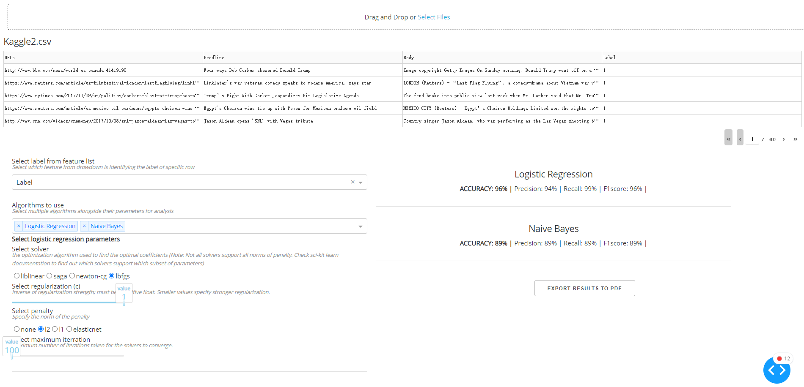
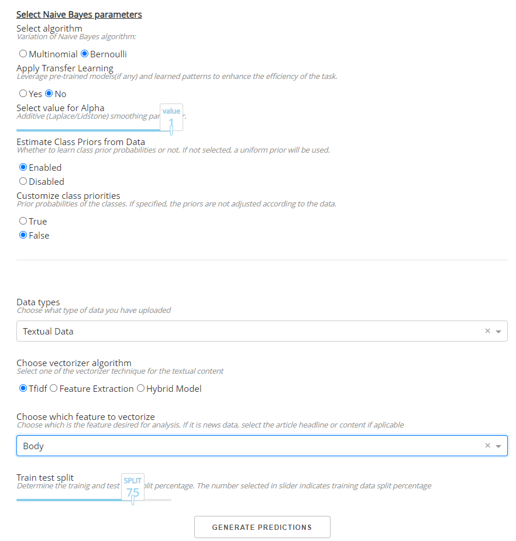

  
Table of Contents

  <ol>
    <li>
      <a href="#about-the-project">About The Project</a>
    </li>
    <li>
      <a href="#built-with">Built With</a>
    </li>
    <li>
        <a href="#getting-started">Geting Started</a>
    </li>
    <li>
        <a href="#contributors">Contributors</a>
    </li>
  </ol>

## About The Project

This project extends an existing application designed to compare different machine learning libraries for fake news detection. It aims to ease the process of selecting and tuning algorithms by integrating an additional machine learning library, namely the Naive Bayes classifier and enabling user customization of key parameters. It also incorperates techniques like Transfer Learning and Incremental Learning. The project provides a versatile tool, beneficial for researchers, journalists, and other stakeholders in the battle against fake news. Besides, it contributes to ongoing research by exploring the performance of various machine learning libraries, shedding light on the development of more robust and efficient fake news detection systems.

### Scope
This project focuses on:

1. **Extension of Existing Application**: The project builds upon an existing application for comparing machine learning libraries in terms of fake news detection.

2. **Inclusion of Additional Library**: The project involves incorporating an additional machine learning library, the Naive Bayes classifier, widening the range of comparison.

3. **Parameter Customization**: The project enables users to customize key parameters of the chosen algorithms, providing greater flexibility and adaptability to various datasets and requirements.

4. **Transfer and Incremental Learning**: The project explores the use of transfer learning and incremental learning methods.Both these methodologies are evaluated for their potential in fake news detection, and their performance is compared to traditional machine learning approaches.

5. **Binary Classification**: The current scope is restricted to fake news detection in terms of binary classification - labeling news as either 'fake' or 'not fake'.

6. **Language Limitation**: The application primarily supports English language datasets at this stage.

7. **Dataset Dependency**: The project's effectiveness depends on the quality and diversity of datasets used for training and testing the models.

8. **Algorithm Comparison**: The project evaluates and compares the performance of the included machine learning libraries.

| :exclamation: Disclaimer: This application explores the use of supervised machine learning methods for fake news detection, focusing on patterns such as writing style and keyword usage. While these techniques can effectively identify some elements common to fake news, they should not be misconstrued as a comprehensive fact-checking system.|
|-------------------------------------------------------------------------------------------------------------------------|

### Supported Machine Learning Models
* Logistic Regression
* Decision Trees
* K-Nearest Neighbors
* Gradient Boosting
* Naïve Bayes (Multinomial and Bernoulli)

### Preprocessing Techniques
1. **Data Loading and Feature Extraction**:
The parse_data function is used for loading and decoding datasets of various formats. The feature_extraction function leverages the Empath tool to analyze text for lexical features.

2. **Feature Selection**:
Feature selection is carried out by the computeAnova and getDatasetWithSignificantFeatures functions, which help to reduce the dimensionality of the dataset.

3. **Data Cleaning and Preprocessing**:
Data cleaning and preprocessing tasks are performed by the drop_na function (which removes missing values), drop_non_english function (that excludes non-English text, though this function is not actively used in this project), and shuffle_csv function (which randomizes DataFrame rows).

4. **Text Preprocessing**:
Text preprocessing includes the removal of punctuation and stopwords (remove_punctuation_stopwords), and word stemming (word_stemming).

5. **Dataset Modifications**:
Functions such as add_label and keep_columns are used to modify the dataset, while mergeDatasetWithLabels merges the dataset and labels.

6. **Text Vectorization**:
Finally, the vectorize_feature function applies TF-IDF vectorization to the input text, preparing it for machine learning algorithms.

(<a href="#readme-top">back to top</a>)

## Built With

This project has used the following libraries / modules:

* 
* 
* 
* 
* 

(<a href="#readme-top">back to top</a>)

## Getting Started
| :exclamation: Note: Install the required dependencies by running `pip install -r requirements.txt`|
|-------------------------------------------------------------------------------------------------------------------------|

Run the `main.py` file and visit `localhost:8050`.

### Step-by-step Guide

1. Load one or more datasets by clicking `Select Files`.
2. Choose the label column from the dropdown menu.
3. Choose one or more ML algorithms from the dropdown menu
4. Customize their parameters.
5. Choose the datatype and vectorization algorithm.
6. Choose the feature column.
7. Divide the dataset into training set and testing set.
8. Generate predictions.

## Contributors

Kevin Wang / S-Number: 3470016

Bedir Chaushi
